# Creating a Retro 2.5D Engine (Trinity Part 1)

<div align="center">

[Home](/) · [Blogs](/blogs) · [Part 2](/blogs/trinity-part-2)

</div>

<details>
	<summary>Table of contents</summary>
	<ul>
		<li>
			<a href="#introduction">Introduction</a>
			<ul>
				<li><a href="#raycasters">Raycasters</a></li>
				<li><a href="#raycasting-vs-doom-build-style">Raycasting vs Doom/Build-style</a></li>
			</ul>
		</li>
		<li>
			<a href="#boilerplate-and-basic-functionality">Boilerplate and Basic Functionality</a>
			<ul>
				<li><a href="#defining-constants">Defining Constants</a></li>
				<li><a href="#camera-setup-and-movement">Camera Setup and Movement</a></li>
				<li><a href="#engine-setup-cleanup">Engine Setup/Cleanup</a></li>
			</ul>
		</li>
		<li>
			<a href="#2d-visualization">2D Visualization</a>
			<ul>
				<li><a href="#transforming-world-space-to-camera-space">Transforming World Space to Camera Space</a></li>
			</ul>
		</li>
		<li>
			<a href="#3d-projection">3D Projection</a>
			<ul>
				<li><a href="#line-clipping">Line Clipping</a></li>
				<li><a href="#field-of-view">Field of View</a></li>
				<li><a href="#wall-filling">Wall Filling</a></li>
				<li><a href="#edge-case">Edge Case</a></li>
			</ul>
		</li>
		<li><a href="#trinity">Trinity</a></li>
		<li><a href="#full-code">Full Code</a></li>
	</ul>
</details>

<h2 id="introduction">Introduction</h2>

I've always found software-rendering fascinating. The idea of manually drawing everything
pixel-by-pixel and optimizing performance to make it work efficiently is just really fun - and so
is building things yourself from scratch, and software rendering is about as close to "ground zero"
as you can get when it comes to graphics programming.

3D games, or, at least games that appear 3D, are also really fun. That's why old games like [Doom](https://en.wikipedia.org/wiki/Doom_(1993_video_game)),
[Quake](https://en.wikipedia.org/wiki/Quake_(video_game)) and even [Half-Life](https://en.wikipedia.org/wiki/Half-Life_(video_game))
(with its software renderer enabled) appeal to people. Not just because they're fun to play, but
also because of the technology behind them. Doom especially has seemed to always stand out, with its
big and loving community constantly making new maps and mods. Its rough, pixelated, 256-color
aesthetic is just really cool, and I've always wondered how it manages to render these complex,
seemingly 3D levels so efficiently using software-rendering.

<h3 id="raycasters">Raycasters</h3>

To uncover this mystery, and satisfy my love of reinventing the wheel, I've made multiple attempts
at writing a [raycaster](https://lodev.org/cgtutor/raycasting.html), which is a very basic
software-rendering technique used in games such as [Wolfenstein 3D](https://en.wikipedia.org/wiki/Wolfenstein_3D).
Raycasting turns a simple 2D tile-based map into a 3D-looking world. My very first attempts were
mostly blind, using code and mathematics I really didn't understand. My earliest real attempt, where
I tried to do it all by myself, was my [3D Pascal raycaster using SDL2](https://www.youtube.com/watch?v=oISXIpo1p5M),
which I made over 4 years ago, when I was around 13. It felt really exciting, even though my code
was terrible and my rendering method even worse. You can see the issues in the video - the weird
"staircase" effect on the edges of walls. It's there because instead of using the proper [DDA](https://www.geeksforgeeks.org/dda-line-generation-algorithm-computer-graphics/)
method, I simply advanced the casted rays by tiny steps. Making those steps really short for
precision would slow down rendering, so I had to find a balance, which led to the visible
distortion.

<div align="center"></div>

I addressed this issue in the [follow-up version of the raycaster](https://www.youtube.com/watch?v=1eSF2SF-pSI),
where I implemented the proper DDA technique, because I've taken the time to try to actually
understand it. This fixed the staircase issue, however, it revealed a different issue - a
perspective distortion effect, which was caused by my incorrect angle calculations for each ray. I
was simply incrementing the ray angle by a fixed value in a for-loop without making sure it properly
aligns with the current screen column.

<div align="center"></div>

> *If you want to read more about raycasting and its specifics, check out  [Lode's raycasting tutorial](https://lodev.org/cgtutor/raycasting.html).*

A couple of years later (around 2 years ago), I began making a 2.5D software-rendered raycasting
game engine engine. I had attempted something similar shortly after my Pascal raycaster, but failed
because I did not have enough experience and skill for such a big project. This time, however, I
felt like I could take it further than before. The previous attempt was in [C++](https://en.wikipedia.org/wiki/C%2B%2B),
but knowing how performance-sensitive raycasters are from experience, I decided to choose [C](https://en.wikipedia.org/wiki/C_(programming_language))
this time.

I ended up rewriting the engine 3 times due to bad design choices and messy code. During the first
rewrite, I named the engine Trinity. It's a cool-sounding word I remembered from some
[post-apocalyptic Roblox game](https://www.roblox.com/games/1600503/Apocalypse-Rising) (no shame).
It could also be seen as a reference to the existing game engine [Unity](https://unity.com/). In
this version, I played around with a map editor and angled walls. I wanted something more advanced
than just the basic block-based raycaster seen in Wolfenstein 3D.

In the second and third rewrites, I introduced floor and ceiling height (similar to Doom) using a
concept I called "sectors", since it shares similarities with Doom's sectors - a sector has a single
floor and ceiling height. I also implemented a procedural water animation with 3D-looking waves.

<div align="center"></div>

> *If you're interested, you can read more about [Trinity history](https://github.com/trinity-engine/.github/blob/main/profile/history.md).*

<h3 id="raycasting-vs-doom-build-style">Raycasting vs Doom/Build-style</h3>

However, I started running into performance issues, and I never managed to properly integrate angled
walls with varying floor/ceiling height. I realised that making an advanced raycaster takes too much
effort and it's not even worth it - it isn't very fast or flexible. This lead to the decision to
scrap the raycasting idea entirely. A Doom-style engine would be faster and much more flexible.

Unlike a raycaster, makes use of a 2D tile grid, a Doom-style engine uses sectors enclosed by lines
on a 2D map. This naturally allows for walls at any angle, without any width or height limitations
at all.

<div align="center">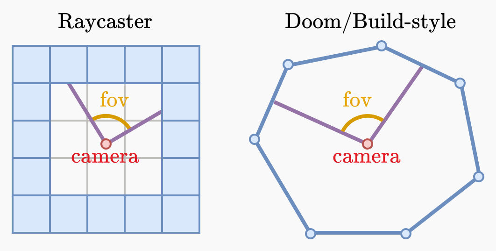</div>

With that decision, I started the fourth (and current) rewrite of Trinity a few months ago. This
time, I avoided the mistakes of my previous rewrites by first developing the skeleton of the
application and engine before geting into the actual 2.5D rendering. I made a software-rendered UI,
a game file browser, a Lua-based build system and some basic file formats, getting to around 4000
lines of code (measured with [cloc](https://github.com/AlDanial/cloc)).

Just a few days ago, I finally started working on the 2.5D renderer. Specifically, I decided to
go for a [Build](https://en.wikipedia.org/wiki/Build_(game_engine))-style renderer rather than a
Doom-style one, since it's simpler. I've never implemented a Build-style renderer before, so I
thought it could be fun to document my journey as I figure it all out.

So far, I've implemented basic 2.5D wall filling and clipping. That might not seem like much (and it
really isn't), but it's enough to start off this blog series.

<div align="center"></div>

> *This is not supposed to be an actual tutorial for Build-style engines, I simply explain how I did
  things, and I can't guarantee that my solutions are 100% correct.*

<h2 id="boilerplate-and-basic-functionality">Boilerplate and Basic Functionality</h2>

So, first things first, we need some boilerplate code. I assume anyone reading this already knows
basic C well enough, so I won't explain basic syntax or other parts of the Trinity source code,
which are not relevant. The main focus is the 2.5D renderer. Functions defined elsewhere in my code
should be self-explanatory from their name.

The 3 main structures we need to define are a point, a wall and a camera:
```c
typedef struct {
	double x, y;
} T_Point;

#define T_NewPoint(X, Y) (T_Point){.x = X, .y = Y}

typedef struct {
	T_Point a, b;
} T_Wall;

typedef struct {
	T_Point p;
	double  z, fov, dir, sin, cos, plane;
} T_Cam;

static T_Cam t_cam;
```
- The `z` member represents the z-height of the camera in 3D space (up/down).
- `sin` and `cos` are pre-calculated from the camera's angle (`dir`).
- `plane` is the length of the camera plane, calculated from the field of view (`fov`) using the
  tangent function:

$$
\begin{aligned}
\text{plane} = \tan\frac{\text{fov}}{2}
\end{aligned}
$$

Here's a visualization:

<div align="center">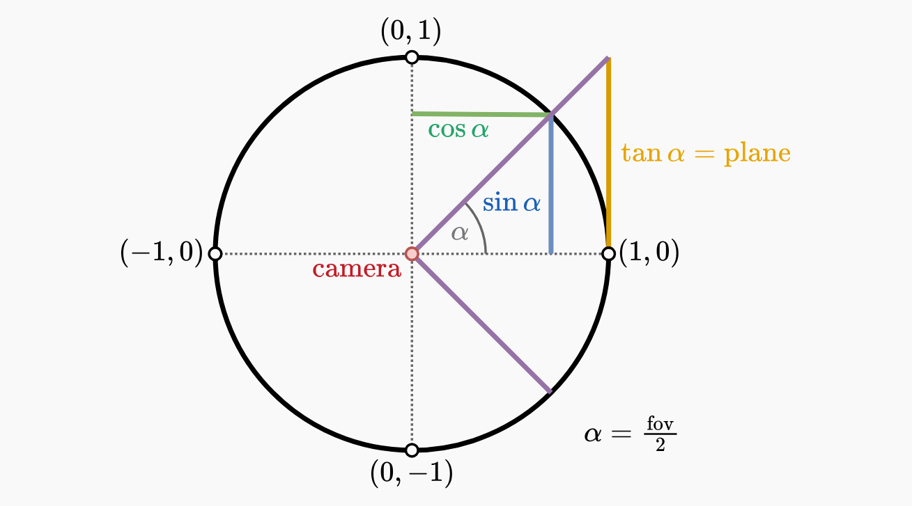</div>

In this image, the field of view is set to 90 degrees, which is the angle we'll use for now, until
we add a proper field of view calculation into the projection.

<h3 id="defining-constants">Defining Constants</h3>

We'll need to define some constants for scaling (for a 2D visualization), the field of view, camera
movement and rotation speed:
```c
#define T_SCALE      30
#define T_PADDING    10
#define T_FOV        T_DegToRad(90)
#define T_MOVE_SPEED 0.003
#define T_ROT_SPEED  0.001
```
For debugging purposes, we will render both a 2D and 3D visualization in 2 separate viewports.
Let's define a struct for those:
```c
typedef struct {
	T_Rect r;
	int    cx, cy;
} T_RenderArea;

T_INLINE T_RenderArea T_NewRenderArea(T_Rect rect) {
	return (T_RenderArea){
		.r  = rect,
		.cx = rect.w/2,
		.cy = rect.h/2,
	};
}

static T_RenderArea t_ra2d, t_ra3d;
```
Each `T_RenderArea` has a viewport rectangle (`r`) and its center coordinates (`cx`, `cy`) which
makes it easier to work with.

<h3 id="camera-setup-and-movement">Camera Setup and Movement</h3>

Now, we need some functions to initialize, move, and rotate the camera:
```c
void T_SetupCam(T_Cam *cam, T_Point p, double z, double fov, double dir) {
	*cam = (T_Cam){
		.p     = p,
		.z     = z,
		.fov   = fov,
		.plane = tan(fov/2),
	};
	T_RotateCam(cam, dir);
}

void T_RotateCam(T_Cam *cam, double angle) {
	cam->dir += angle;
	cam->sin  = sin(cam->dir);
	cam->cos  = cos(cam->dir);
}

void T_MoveCamForward(T_Cam *cam, double step) {
	cam->p.x += cam->cos * step;
	cam->p.y += cam->sin * step;
}

void T_MoveCamBackward(T_Cam *cam, double step) {
	cam->p.x -= cam->cos * step;
	cam->p.y -= cam->sin * step;
}

void T_MoveCamLeft(T_Cam *cam, double step) {
	cam->p.x -= cam->sin * step;
	cam->p.y += cam->cos * step;
}

void T_MoveCamRight(T_Cam *cam, double step) {
	cam->p.x += cam->sin * step;
	cam->p.y -= cam->cos * step;
}
```
These functions use simple trigonometry to turn the camera's direction (`dir`) into a 2D offset by
which we move the camera's x and y positions. See the visualization:

<div align="center">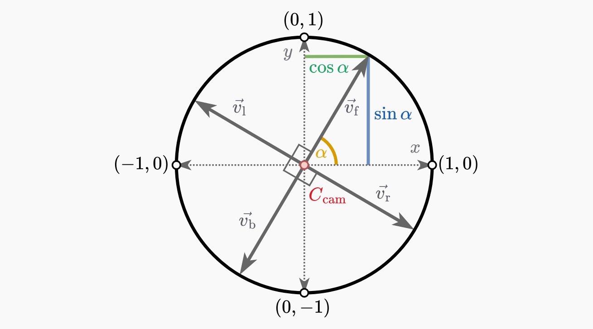</div>

- $\alpha$ = camera angle
- $C_\text{cam}$ = camera point (position)
- $\vec{v_\text{f}}$, $\vec{v_\text{l}}$, $\vec{v_\text{r}}$, $\vec{v_\text{b}}$ = forward, left,
  right and backward movement vectors, respectively

According to the visualization, we can calculate forward movement like so:
$$
\begin{aligned}
\vec{v_\text{f}} = C_\text{cam} + l_\text{step}\left(\cos\alpha,\sin\alpha\right)
\end{aligned}
$$
Backward movement is the opposite to forward movement, so we can subtract instead of adding:
$$
\begin{aligned}
\vec{v_\text{b}} = C_\text{cam} - l_\text{step}\left(\cos\alpha,\sin\alpha\right)
\end{aligned}
$$
Left and right movement vectors are perpendicular to the camera angle, so we can add and subtract 90
degrees ($\pm\frac{\pi}{2}$) from the camera angle to calculate the movement:
$$
\begin{aligned}
\vec{v_\text{l}} &= C_\text{cam} + l_\text{step}\left(\cos\left(\alpha+\frac{\pi}{2}\right),\sin\left(\alpha+\frac{\pi}{2}\right)\right) \\
\vec{v_\text{r}} &= C_\text{cam} + l_\text{step}\left(\cos\left(\alpha-\frac{\pi}{2}\right),\sin\left(\alpha-\frac{\pi}{2}\right)\right)
\end{aligned}
$$
However, we know that cosine is just sine offset by $\frac{\pi}{2}$. We can use this knowledge to
simplify these 2 calculations:
$$
\begin{aligned}
\vec{v_\text{l}} &= C_\text{cam} + l_\text{step}\left(-\sin\alpha,\cos\alpha\right) \\
\vec{v_\text{r}} &= C_\text{cam} + l_\text{step}\left(\sin\alpha,-\cos\alpha\right)
\end{aligned}
$$

<h3 id="engine-setup-cleanup">Engine Setup/Cleanup</h3>

Next, we define what to do on engine setup and cleanup:
```c
void T_SetupEngine(void) {
	T_SetupCam(&t_cam, T_NewPoint(0, 0), 0.5, T_FOV, 0);

	int w = T_VideoWidth() / 2 - T_PADDING * 2, h = T_VideoHeight() - T_PADDING * 2;
	t_ra2d = T_NewRenderArea(T_NewRect(T_PADDING, T_PADDING, w / 2, h));
	t_ra3d = T_NewRenderArea(T_NewRect(T_PADDING * 3 + w / 2, T_PADDING, w * 1.5, h));
}

void T_CleanupEngine(void) {}
```
- The camera starts at the center of the world ($\left(0,0\right)$) with a z-height of 0.5, because
  the walls will start at z-height 0 and end at z-height 1.
- We initialize the 2D and 3D viewports.
- Nothing needs to be done for cleanup.

<h2 id="2d-visualization">2D Visualization</h2>

Now, let's visualize the viewports and draw a basic player in the center of the 2D viewport, facing
up:
```c
static void T_RenderViewportBorder(void) {
	T_DrawRect(T_RectWithPos(T_GetViewport(), 0, 0), 1, 2, 4);
}

static void T_Render2dPlayer(void) {
	double fovSin = sin(T_FOV/2), fovCos = cos(T_FOV/2);
	T_DrawVertLine(t_ra2d.cx, t_ra2d.cy, -10, 18);
	T_DrawLine(t_ra2d.cx, t_ra2d.cy, t_ra2d.cx + fovSin * 10, t_ra2d.cy - fovCos * 10, 18);
	T_DrawLine(t_ra2d.cx, t_ra2d.cy, t_ra2d.cx - fovSin * 10, t_ra2d.cy - fovCos * 10, 18);
	T_DrawPoint(t_ra2d.cx, t_ra2d.cy, 7);
}

void T_RenderEngine(double dt) {
	T_Unused(dt);
	T_ClearVideo();

	T_BeginViewport(t_ra2d.r);
	T_RenderViewportBorder();
	T_Render2dPlayer();
	T_EndViewport();

	T_BeginViewport(t_ra3d.r);
	T_RenderViewportBorder();
	T_EndViewport();
}
```
- Basic trigonometry is utilized to visualize the camera's field of view angle.
- The `T_DrawRect` function takes the rectangle's border thickness, border dash spacing, and color
  in order as its last 3 parameters - every `T_Draw...` function takes color as its last parameter.
  I use a 256-color palette, so the color is simply n index into the palette.

When we run the code, it looks like this:

<div align="center"></div>

So far, so good... so what!

We drew the camera at the center of the 2D viewport because it will remain fixed in that position.
When rendering, instead of moving the camera around the world, we move the world around the camera -
the *camera space*. It might seem strange, but it simplifies calculations.

In camera space, the camera is at the center, $\left(0,0\right)$. When converting world space
coordinates into camera space, the y-coordinate becomes the distance from the camera's x-axis. Take,
for example, this 2D wall with 2 points, A and B, visualized in camera space:

<div align="center"></div>

We can determine how far each point is from the camera's x-axis by simply taking the y-position of
the point. If the y-position is below 0, the point is below the camera's x-axis and therefore behind
the camera. This will be useful for clipping.

In camera space, the camera will always face upward, and the world rotates around it accordingly.
You could make it face left, right or even down, if you want, but it makes the most sense to have it
face up. That way, in 3D projection, the camera space x-axis corresponds to the screen's x-axis and
the y-axis represents depth.

And now, let's add a single wall:
```c
static T_Wall t_walls[] = {
	{.a = {.x = 1, .y = -1}, .b = {.x = 1, .y = 1}},
};
```
Next, we need to iterate through the walls array and render each one:
```c
void T_RenderEngine(double dt) {
	T_Unused(dt);
	T_ClearVideo();

	for (size_t i = 0; i < T_LenOf(t_walls); ++ i)
		T_RenderWall(t_walls + i);

	...
}
```
`T_LenOf` is a macro which calculates the number of elements in a static array.

<h3 id="transforming-world-space-to-camera-space">Transforming World Space to Camera Space</h3>

To render a wall, we first need to transform its points from world space into camera space. Let's
define a simple function for that:
```c
static T_Point T_WorldToCamPos(T_Point p) {
	p.x -= t_cam.p.x;
	p.y -= t_cam.p.y;
	return (T_Point){
		.x = p.x * t_cam.sin - p.y * t_cam.cos,
		.y = p.x * t_cam.cos + p.y * t_cam.sin,
	};
}
```
First, we offset the point by subtracting the camera's position from it. However, we still have to
rotate the point based on the camera's angle.

To do this, we use something called a [rotation matrix](https://en.wikipedia.org/wiki/Rotation_matrix).
For example, let's look at how point A changes when you rotate it by 90 degrees (point A'):

<div align="center">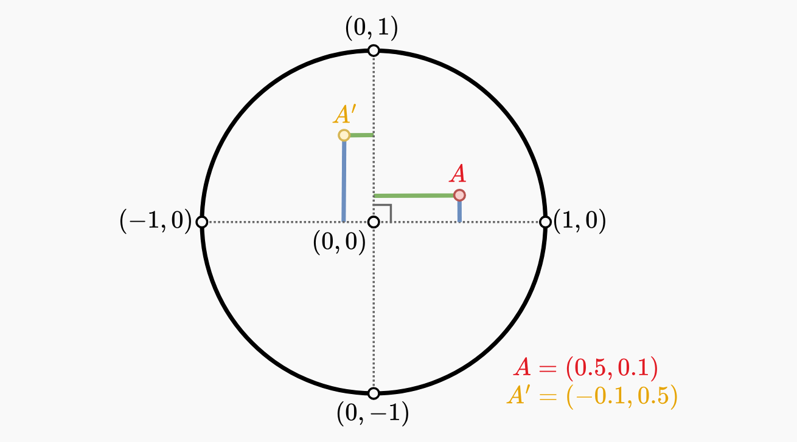</div>

As you can see, the x and y coordinates got swapped, and the x-coordinate became negative. We can
achieve that behavior using trigonometry:
- $\sin0\degree = 0$ and $\cos0\degree = 1$
- $\sin90\degree = 1$ and $\cos90\degree = 0$

Using that to achieve the swapping effect, the coordinates can be calculated like so:
$$
\begin{bmatrix} x' \\ y' \end{bmatrix} =
\begin{bmatrix} \cos\alpha & -\sin\alpha \\ \sin\alpha & \cos\alpha \end{bmatrix}
\begin{bmatrix} x \\ y \end{bmatrix}
$$
Which means the new coordinates are:
$$
\begin{aligned}
x' &= x\cos\alpha - y\sin\alpha \\
y' &= x\sin\alpha + y\cos\alpha
\end{aligned}
$$
- $\left(x,y\right)$ = original point
- $\left(x',y'\right)$ = rotated point

However, because our camera faces upwards ($90\degree$), not left ($0\degree$), we have to modify
the formula by swapping $\sin$ and $\cos$:
$$
\begin{aligned}
x' &= x\sin\alpha - y\cos\alpha \\
y' &= x\cos\alpha + y\sin\alpha
\end{aligned}
$$
Now, we can render the transformed wall as a line in the 2D viewport:
```c
static void T_RenderWall(T_Wall *l) {
	/* Line points in camera space */
	T_Point a = T_WorldToCamPos(l->a), b = T_WorldToCamPos(l->b);

	T_Render2dLine(a, b, 8, 7);
}
```
The `T_RenderWall` function will have more code added to it later, so let's put the code for
line-drawing inside the 2D viewport in a separate function:
```c
static void T_Render2dLine(T_Point a, T_Point b, uint8_t linePx, uint8_t pointPx) {
	int ax = t_ra2d.cx + a.x * T_SCALE, ay = t_ra2d.cy - a.y * T_SCALE,
	    bx = t_ra2d.cx + b.x * T_SCALE, by = t_ra2d.cy - b.y * T_SCALE;

	T_BeginViewport(t_ra2d.r);
	T_DrawLine(ax, ay, bx, by, linePx);
	T_DrawPoint(ax, ay, pointPx);
	T_DrawPoint(bx, by, pointPx);
	T_EndViewport();
}
```
Here, we just scale and offset the points so that $\left(0,0\right)$ is in the center of the 2D
viewport. We subtract the y-coordinate but not x-coordinate because, as seen in the visualizations,
our world space uses the regular 4-quadrant coordinate system where $\left(0,0\right)$ is the
center, but on the screen, the top-left corner is $\left(0,0\right)$ and both x and y coordinates
increase as you approach the bottom-right corner. This means that, compared to our world space's
y-coordinate, the screen's y-coordinate is negated.

If we run the code, we get a nice line:

<div align="center">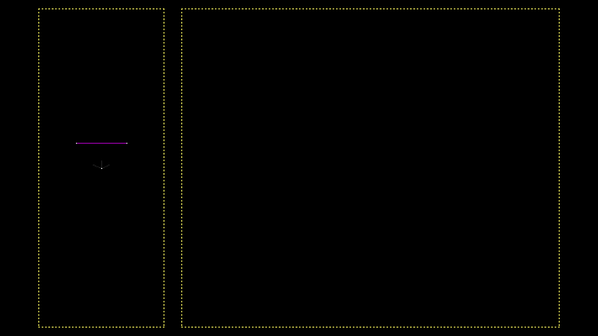</div>

> *`T_DrawLine` uses [Bresenham's line algorithm](https://en.wikipedia.org/wiki/Bresenham%27s_line_algorithm) for line rendering.*

Pretty nice! But a bit boring. Let's add movement:
```c
void T_UpdateEngine(double dt) {
	if (t_keyboard[SDL_SCANCODE_E]) T_RotateCam      (&t_cam,  T_PI * T_ROT_SPEED * dt);
	if (t_keyboard[SDL_SCANCODE_Q]) T_RotateCam      (&t_cam, -T_PI * T_ROT_SPEED * dt);
	if (t_keyboard[SDL_SCANCODE_W]) T_MoveCamForward (&t_cam, T_MOVE_SPEED * dt);
	if (t_keyboard[SDL_SCANCODE_A]) T_MoveCamLeft    (&t_cam, T_MOVE_SPEED * dt);
	if (t_keyboard[SDL_SCANCODE_S]) T_MoveCamBackward(&t_cam, T_MOVE_SPEED * dt);
	if (t_keyboard[SDL_SCANCODE_D]) T_MoveCamRight   (&t_cam, T_MOVE_SPEED * dt);
}
```
This function is called every frame. `dt` is the delta time of the current frame - the amount of
time in milliseconds the frame took to execute. The rest of this code is pretty self-explanatory.

If you move and look around, you can see the line moves and rotates around the camera as expected:

<div align="center"></div>

<h2 id="3d-projection">3D Projection</h2>

It's time to get something 3D-looking on the screen. This process is not very hard - we simply
project the camera space points onto the screen. So let's define a function for that:
```c
static void T_ProjectPoint(T_Point p, double z1, double z2, int *x, int *y1, int *y2) {
	double scale = (double)t_ra3d.cx / p.y;
	*x  = t_ra3d.cx + p.x            * scale;
	*y1 = t_ra3d.cy - (z1 - t_cam.z) * scale; /* Point z height start */
	*y2 = t_ra3d.cy - (z2 - t_cam.z) * scale; /* Point z height end */
}
```
In order to understand how projecting a point works, we have to look at how a 2D top-down view of
the scene looks compared to a 3D view from the camera:

<div align="center">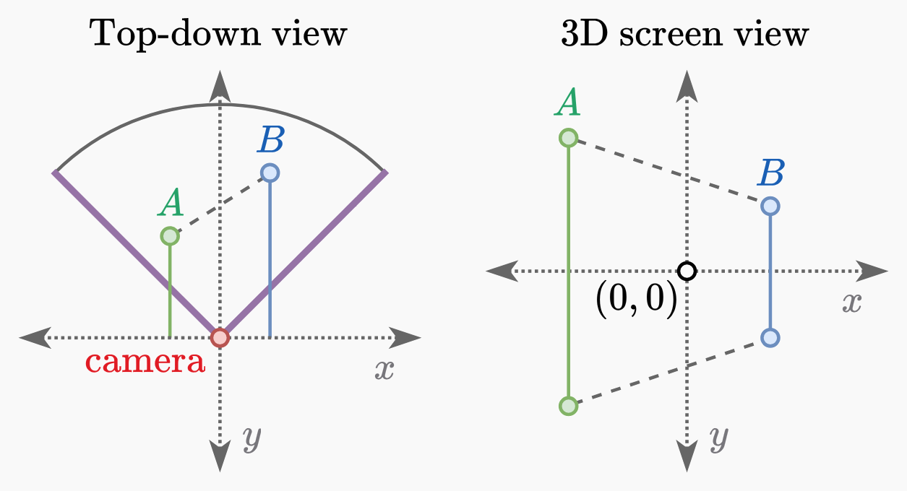</div>

The wall has an arbitrary height to better visualize this. We can notice a simple rule - The farther
an object is from the camera, the smaller it appears. The closer the point is to the camera's
x-axis, the bigger the projected point's height is and the farther from the center of the screen it
is. So, the closer to the camera's x-axis the point is, the farther away from the center of the
screen the screen x and y positions of the point are.

Since we know that the distance of a point from the camera's x-axis is the y-position of that point,
this means we have to divide the x-position of the point by the y-position of the point to get the
point's x-position on the screen. Similarly, we divide the z-height of the point by the y-position
of the point to get the point's y-position on the screen:
$$
\begin{aligned}
x' &= \frac{x}{y} \\
y' &= \frac{z}{y}
\end{aligned}
$$
- $\left(x',y'\right)$ = projected screen coordinates
- $\left(x,y,z\right)$ = camera space coordinates (including z-height)

We have to keep in mind that we are still looking at the world from a top-down view - we are not
doing real 3D. That means, from a top-down view, the point's y-position is up/down and the
x-position is left/right. From the view of the camera (on the screen), the point's y-position
becomes the depth, the x-position is left/right and the z-height is up/down. The z-height cannot be
represented on a 2D top-down view.

Since we defined our point to be 2D, the wall's starting and ending z-heights are passed as separate
arguments, `z1` and `z2`, where `z1` is where the wall starts (bottom of the wall), and `z2` is
where the wall ends (top of the wall). The point is in camera space, but the z-height values we pass
in are not, so we have to subtract the camera z-height from them.

Next, we scale up the screen coordinates to fit our viewport. To keep a 1:1 aspect ratio (preventing
horizontal or vertical stretching), We scale them both by the viewport's width. I decided to use the
viewport's width for scaling, but you could also use the height, that's up to you. The calculation
looks like this:
$$
\begin{aligned}
x' &= \frac{w}{2} + w\frac{x}{y} \\
y' &= \frac{h}{2} - w\frac{z}{y}
\end{aligned}
$$
- $\left(x',y'\right)$ = projected screen coordinates, scaled up correctly for our viewport

We scale the positions and subtract them from the width and height for the x and y axes,
respectively, to make sure the center of the screen is positioned correctly. In my code, I
pre-calculate $\frac{w}{2}$ and $\frac{h}{2}$ and store them as `.cx` and `.cy` in the
`T_RenderArea` struct for convenience and efficiency.

However, there is still one more thing we can do about this code - reduce the amount of divisions.
This might seem pointless, but in software-rendering, every little thing counts, especially when
it's getting rid of something that's performed for each point of a wall. Instead of dividing twice,
we calculate the scale and simplify our 2 equations:
$$
\begin{aligned}
s_\text{scale} &= \frac{w}{y} \\
x' &= \frac{w}{2} + s_\text{scale}x \\
y' &= \frac{h}{2} - s_\text{scale}z
\end{aligned}
$$
So now, let's write a function to render a 3D line:
```c
static void T_Render3dLine(T_Point a, T_Point b, uint8_t linePx, uint8_t pointPx) {
	int ax, ay1, ay2, /* Screen coordinates for wall point A */
	    bx, by1, by2; /* Screen coordinates for wall point B */
	T_ProjectPoint(a, 0, 1, &ax, &ay1, &ay2);
	T_ProjectPoint(b, 0, 1, &bx, &by1, &by2);

	T_BeginViewport(t_ra3d.r);
	/* Render wall points */
	T_DrawVertLine(ax, ay1, ay2 - ay1, pointPx);
	T_DrawVertLine(bx, by1, by2 - by1, pointPx);

	T_DrawLine(ax, ay1, bx, by1, pointPx);
	T_DrawLine(ax, ay2, bx, by2, pointPx);
	T_EndViewport();
}

static void T_RenderWall(T_Wall *l) {
	/* Line points in camera space */
	T_Point a = T_WorldToCamPos(l->a), b = T_WorldToCamPos(l->b);

	T_Render2dLine(a, b, 8, 7);
	T_Render3dLine(a, b, 8, 7);
}
```
We project the wall's points and connect them with lines. For now, the wall's `z1` and `z2` values
will be hardcoded to 0 and 1 respectively.

<div align="center"></div>

Works like a charm. But you may notice that something very weird happens if one of the points moves
behind the camera:

<div align="center">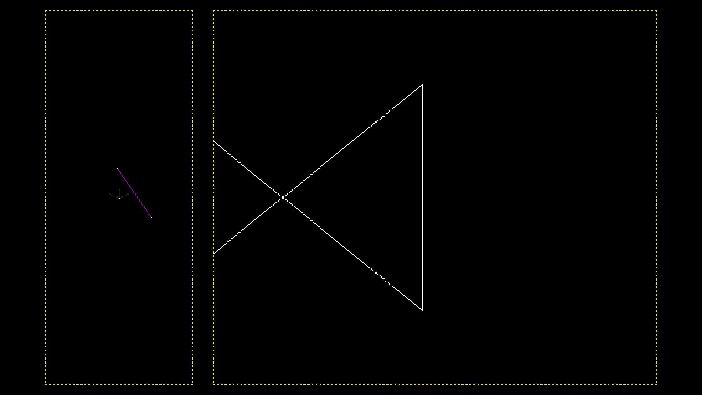</div>

And when the entire wall is behind the camera, we suddenly got eyes on the back of our head!

<div align="center">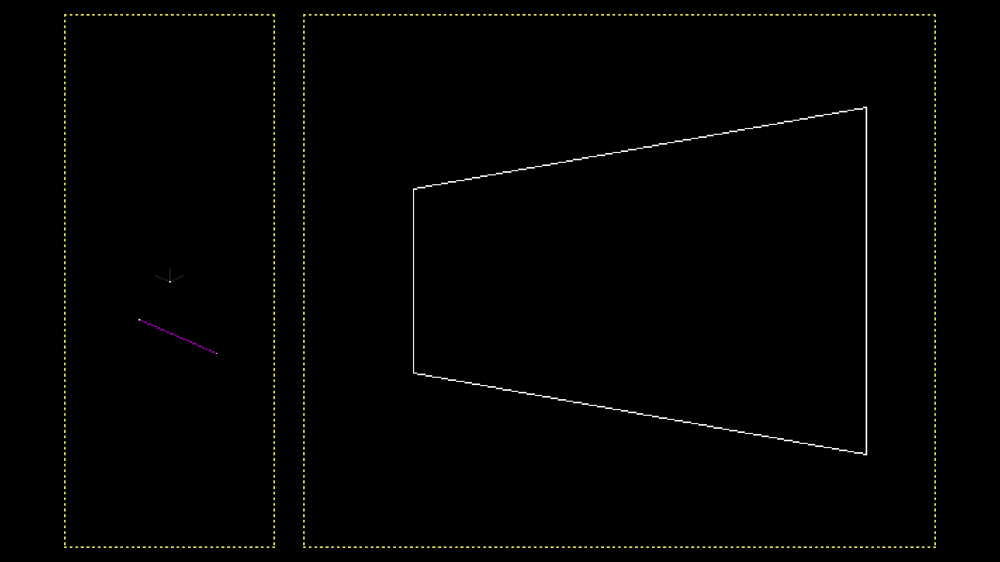</div>

This happens because when a point is behind the camera's x-axis in camera space, its y-position is
less than 0 - negative. Since projection involves dividing by the y-position, this calculation
returns negative values, which results in inverted screen coordinates. In order to fix this, we need
to clip the line before projecting the points.

<h3 id="line-clipping">Line Clipping</h3>

There are several ways to approach this problem, including using vector cross products. However, I
came up with my own solution, using mathematics I understand. Using vector cross products might be a
better solution, but I don't fully understand them, and my method is efficient and works well.

First, we need to define a constant for the minimum y-position, under which the line will get
clipped - the clip plane:
```c
#define T_CLIP_PLANE_Y 0.1
```
This value can be very small, but not 0, because then the clipping code would cause a
division-by-zero error.

Let's define a function to clip a line's point against the clip plane:
```c
static void T_ClipLinePoint(T_Point *a, T_Point b) {
	a->x += (T_CLIP_PLANE_Y - a->y) / (b.y - a->y) * (b.x - a->x);
	a->y  = T_CLIP_PLANE_Y;
}
```
This function clips point `a` by interpolating between `a` and `b` based on intersection with the
clip plane. It's just simple [linear interpolation](https://en.wikipedia.org/wiki/Linear_interpolation):

<div align="center"></div>

Here, point C is the intersection of the line with the clip plane - the clipped version of point A.
Since we know that the y-position of point C is equal to the y-position of the clip plane (0.1), we
can calculate the x-position of point C by finding out at what percentage of the line the
intersection happens (a value from 0 to 1). Since we know the y positions of all 3 points, we can
use them for this calculation. If we divide the vertical distance of point A from the clip plane by
the vertical distance between point A and point B, we get the percentage at which the intersection
occurs:
$$
\begin{aligned}
C_y &= 0.1 \\
t &= \frac{C_y - A_y}{B_y - A_y} \\
C_x &= A_x + t\left(B_x - A_x\right)
\end{aligned}
$$
Let's use the clipping function in our code to clip walls before rendering:
```c
static void T_RenderWall(T_Wall *l) {
	/* Line points in camera space */
	T_Point a = T_WorldToCamPos(l->a), b = T_WorldToCamPos(l->b);

	T_Point ca = a, cb = b; /* Clipped line points in camera space */
	bool behindCam = a.y < T_CLIP_PLANE_Y && b.y < T_CLIP_PLANE_Y;
	if (!behindCam) {
		if      (ca.y < T_CLIP_PLANE_Y) T_ClipLinePoint(&ca, cb);
		else if (cb.y < T_CLIP_PLANE_Y) T_ClipLinePoint(&cb, ca);
	}

	T_Render2dLine(a, b, 18, 25);
	if (!behindCam) {
		T_Render2dLine(ca, cb, 8, 7);
		T_Render3dLine(ca, cb, 8, 7);
	}
}
```
- We check for clipping of both points and only clip if needed.
- `T_Render2dLine` is called twice in order to visualize both the original and clipped line.
- If the wall is behind the camera, we skip 3D rendering and 2D visualization of the clipped line.

<div align="center">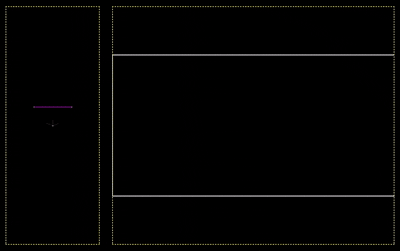</div>

Everything works as it should now. There is however one side effect from using a clip plane - walls
appear cut off when too close to the camera. This doesn't happen in the original Doom, but it's
common in modern 3D engines. However, once collision detection is implemented, it won't matter.

<h3 id="field-of-view">Field of View</h3>

We're gonna set the field of view to something other than 90 degress now, for example 70 degrees:
```
#define T_FOV T_DegToRad(70)
```
Now, in order to implement a field of view, we need to modify `T_ProjectPoint`:
```c
static void T_ProjectPoint(T_Point p, double z1, double z2, int *x, int *y1, int *y2) {
	double scale = (double)t_ra3d.cx / (p.y * t_cam.plane);
	...
}
```
The depth value gets scaled by the camera's plane. With a 90-degree field of view, the camera's
plane was equal to 1 ($\tan45\degree = 1$), so this multiplication had no effect. When field of view
decreases, objects appear to "zoom in", because the camera's plane value goes below 1. When it
decreases, objects appear to "zoom out", because the camera's plane value goes above 1.

<h3 id="wall-filling">Wall Filling</h3>

The last thing left to do is to fill the wall. Even though the concept is simple, this is actually
probably the most involved part so far.

First, let's only render the wall if it's in our field of view:
```c
static void T_Render3dLine(T_Point a, T_Point b, uint8_t linePx, uint8_t pointPx) {
	int ax, ay1, ay2, /* Screen coordinates for wall point A */
	    bx, by1, by2; /* Screen coordinates for wall point B */
	T_ProjectPoint(a, 0, 1, &ax, &ay1, &ay2);
	T_ProjectPoint(b, 0, 1, &bx, &by1, &by2);

	/* Is wall in FOV? */
	if ((ax < 0 && bx < 0) || (ax >= t_ra3d.r.w - 1 && bx >= t_ra3d.r.w - 1))
		return;

	...
}
```
If both points are off-screen to the left or right, we skip rendering.

It will be easier to fill the wall if we order its points from left to right. Let's also leave a
small gap around the viewport border to make sure we are not rendering outside the viewport:
```c
static void T_Render3dLine(T_Point a, T_Point b, uint8_t linePx, uint8_t pointPx) {
	...

	/* Order points from left to right for simpler rendering */
	if (ax > bx) {
		T_Swap(int, ax,  bx);
		T_Swap(int, ay1, by1);
		T_Swap(int, ay2, by2);
	}

	T_BeginViewport(t_ra3d.r);
	/* Render wall points */
	if (ax >= 2 && ax < t_ra3d.r.w - 2) T_DrawVertLine(ax, ay1, ay2 - ay1, pointPx);
	if (bx >= 2 && bx < t_ra3d.r.w - 2) T_DrawVertLine(bx, by1, by2 - by1, pointPx);

	T_DrawLine(ax, ay1, bx, by1, pointPx);
	T_DrawLine(ax, ay2, bx, by2, pointPx);
	T_EndViewport();
}
```
Next, we can save the initial starting x-position (`ax0`) and calculate the wall's screen width
(`w`). Then, we add boundary checks (with a small gap) to avoid filling outside the viewport:
```c
static void T_Render3dLine(T_Point a, T_Point b, uint8_t linePx, uint8_t pointPx) {
	...

	T_DrawLine(ax, ay1, bx, by1, pointPx);
	T_DrawLine(ax, ay2, bx, by2, pointPx);

	int ax0 = ax, w = bx - ax0; /* Wall screen x start and wall screen width */
	/* Avoid rendering outside the window */
	if      (ax < 2) ax = 2;
	else if (bx < 2) bx = 2;
	if      (ax >= t_ra3d.r.w - 2) ax = t_ra3d.r.w - 3;
	else if (bx >= t_ra3d.r.w - 2) bx = t_ra3d.r.w - 3;

	T_EndViewport();
}
```
And now, we can start filling from left to right. For each screen column, we calculate at what
percentage of the wall we currently are:
$$
\begin{aligned}
t = \frac{x - a_{x_0}}{b_x - a_{x_0}}
\end{aligned}
$$
- $x$ = current screen x-position

With this, the vertical boundaries of the current column can
easily be calculated using linear interpolation:
$$
\begin{aligned}
y_1 &= a_{y_1} + t\left(b_{y_1} - a_{y_1}\right) \\
y_2 &= a_{y_2} + t\left(b_{y_2} - a_{y_2}\right)
\end{aligned}
$$
Then, we loop from $y_2$ to $y_1$ to fill the column. We also need to make sure we're not drawing
outside the viewport:
```c
static void T_Render3dLine(T_Point a, T_Point b, uint8_t linePx, uint8_t pointPx) {
	...

	/* Fill wall */
	for (int x = ax; x <= bx; ++ x) {
		/* Calculate wall's vertical screen boundaries at current column */
		double t = (double)(x - ax0) / w;
		int y1 = ay1 + t * (by1 - ay1), y2 = ay2 + t * (by2 - ay2);
		if (y1 >= t_ra3d.r.h - 2) y1 = t_ra3d.r.h - 3;
		if (y2 < 2) y2 = 2;

		/* Render wall column */
		for (int y = y2; y <= y1; ++ y)
			T_DrawPoint(x, y, linePx);
	}
	T_EndViewport();
}
```

<div align="center"></div>

Our code seems to be working! But it's drawing over the white wall outline. We could reorder the
draw calls, but when we add multiple walls it could cause issues with the drawing order. Instead,
let's fill only every other row of the wall for now:
```c
static void T_Render3dLine(T_Point a, T_Point b, uint8_t linePx, uint8_t pointPx) {
	...

	/* Fill wall */
	for (int x = ax; x <= bx; ++ x) {
		...

		/* Render wall column */
		for (int y = y2; y <= y1; ++ y) {
			if (y % 2 == 0)
				T_DrawPoint(x, y, linePx);
		}
	}

	...
}
```

<div align="center">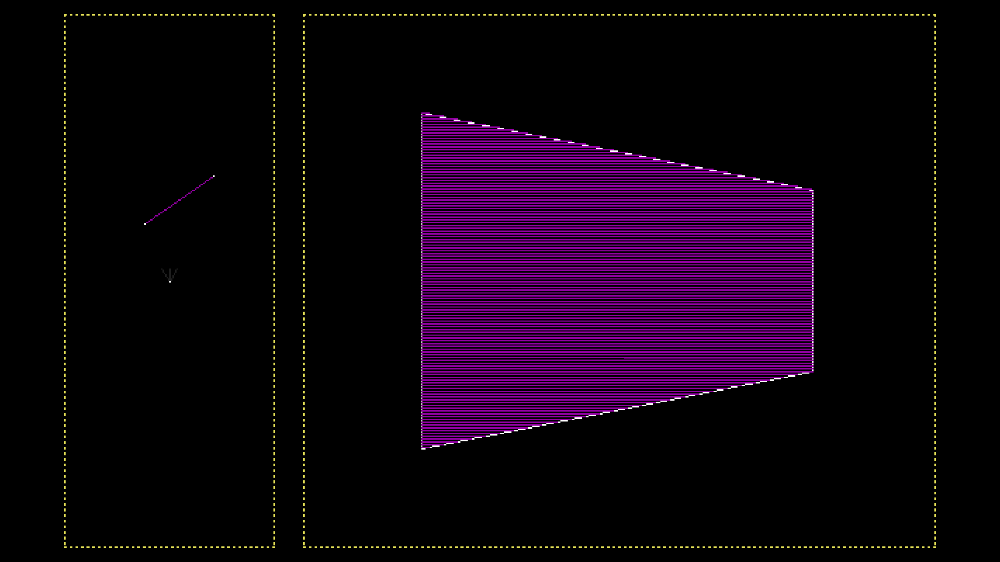</div>

Looking good.

<h3 id="edge-case">Edge Case</h3>

There is one subtle edge-case that we haven't considered, which happens when the wall is looked at
from a very specific angle, causing it to be only 1 pixel wide on the screen. This results in a
division-by-zero error when calculating `t`, because `w` becomes 0. This does not cause visible
issues because we are rendering the white wall outline.

<div align="center">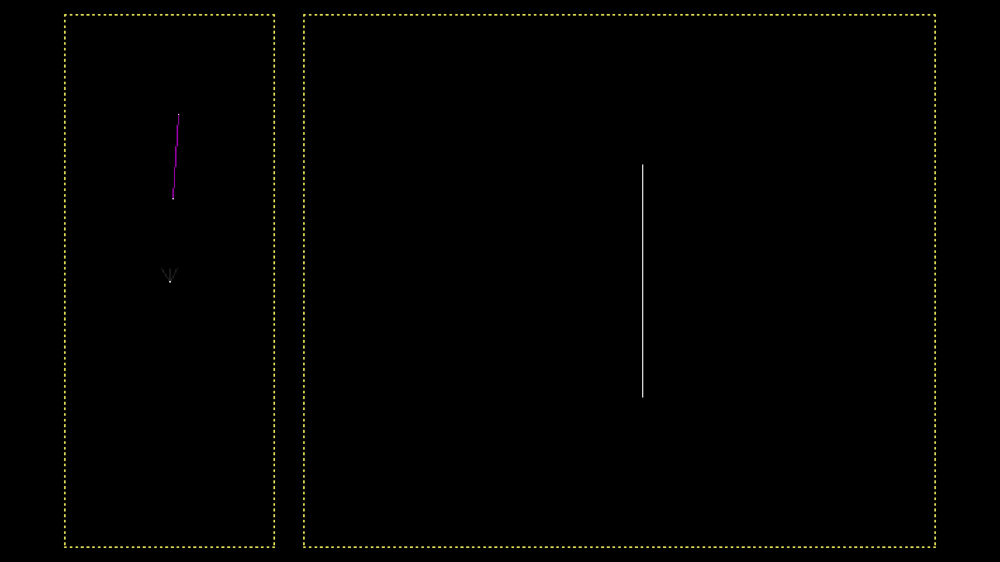</div>

But if we remove that code, the wall suddenly disappears.

<div align="center"></div>

This is because `t` becomes `-nan`, causing our vertical loop to not run. If I had used my
`T_DrawVertLine` function, which allows to draw lines with negative height, the program would have
frozen for some time trying to draw a really long vertical line. To handle this edge case, we need
to check for when `w` is 0. When that happens, we simply take the highest and lowest y values of
the two points:
```c
static void T_Render3dLine(T_Point a, T_Point b, uint8_t linePx, uint8_t pointPx) {
	...

	/* Fill wall */
	for (int x = ax; x <= bx; ++ x) {
		/* Calculate wall's vertical screen boundaries at current column */
		int y1, y2;
		if (w == 0) {
			/* Get the lowest and highest wall screen y position */
			y1 = ay1 > by1? ay1 : by1;
			y2 = ay2 > by2? by2 : ay2;
		} else {
			double t = (double)(x - ax0) / w;
			y1 = ay1 + t * (by1 - ay1);
			y2 = ay2 + t * (by2 - ay2);
		}
		if (y1 >= t_ra3d.r.h - 2) y1 = t_ra3d.r.h - 3;
		if (y2 < 2) y2 = 2;

		...
	}

	...
}
```
Now the rendering should work just fine. Let's add more walls to see what happens:
```c
static T_Wall t_walls[] = {
	{.a = {.x = 1, .y = -1}, .b = {.x = 1, .y =  1}},
	{.a = {.x = 1, .y =  1}, .b = {.x = 3, .y =  1}},
	{.a = {.x = 3, .y =  1}, .b = {.x = 3, .y = -1}},
	{.a = {.x = 3, .y = -1}, .b = {.x = 1, .y = -1}},
};
```

<div align="center"></div>

Great! And of course, since this is a Build-style engine, you can have any shapes and angles
you want, not just squares.

<div align="center">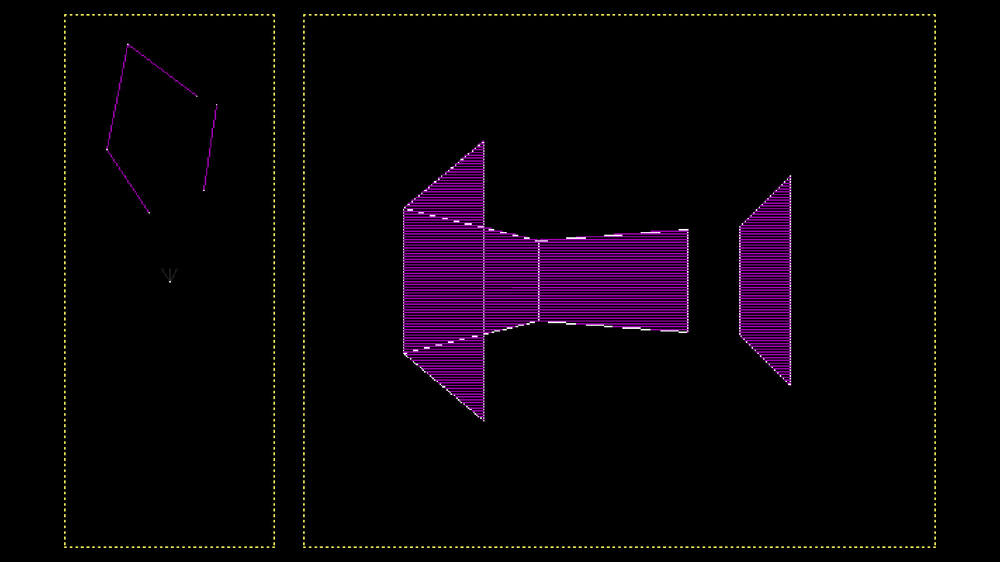</div>

But it looks a little boring - it's missing textures. We also don't handle rendering order. We'll
add those in the next part.

<h2 id="trinity">Trinity</h2>

I've created a [Trinity Github organization](https://github.com/trinity-engine) if you're
interested. At the time of writing, the source code of Trinity hasn't been published there yet, but
by the time you're reading this, it might be.

<h2 id="full-code">Full Code</h2>

Here's this part's full code:
```c
/* ========== Header File Code ========== */

typedef struct {
	double x, y;
} T_Point;

#define T_NewPoint(X, Y) (T_Point){.x = X, .y = Y}

typedef struct {
	T_Point a, b;
} T_Wall;

typedef struct {
	T_Point p;
	double  z, fov, dir, sin, cos, plane;
} T_Cam;

void T_SetupCam       (T_Cam *cam, T_Point p, double z, double fov, double dir);
void T_RotateCam      (T_Cam *cam, double by);
void T_MoveCamForward (T_Cam *cam, double by);
void T_MoveCamBackward(T_Cam *cam, double by);
void T_MoveCamLeft    (T_Cam *cam, double by);
void T_MoveCamRight   (T_Cam *cam, double by);

typedef struct {
	T_Rect r;
	int    cx, cy;
} T_RenderArea;

T_INLINE T_RenderArea T_NewRenderArea(T_Rect rect);

void T_SetupEngine(void);
void T_CleanupEngine(void);

void T_RenderEngine(double dt);
void T_UpdateEngine(double dt);
void T_EngineHandleEvent(SDL_Event *evt);

/* Inline definitions */
T_INLINE T_RenderArea T_NewRenderArea(T_Rect rect) {
	return (T_RenderArea){
		.r  = rect,
		.cx = rect.w/2,
		.cy = rect.h/2,
	};
}

/* ========== Source File Code ========== */

#define T_SCALE        30
#define T_PADDING      10
#define T_FOV          T_DegToRad(70)
#define T_CLIP_PLANE_Y 0.1
#define T_MOVE_SPEED   0.003
#define T_ROT_SPEED    0.001

static T_RenderArea t_ra2d, t_ra3d;
static T_Cam        t_cam;
static T_Wall       t_walls[] = {
	{.a = {.x = 1, .y = -1}, .b = {.x = 1, .y =  1}},
	{.a = {.x = 1, .y =  1}, .b = {.x = 3, .y =  1}},
	{.a = {.x = 3, .y =  1}, .b = {.x = 3, .y = -1}},
	{.a = {.x = 3, .y = -1}, .b = {.x = 1, .y = -1}},
};

void T_SetupCam(T_Cam *cam, T_Point p, double z, double fov, double dir) {
	*cam = (T_Cam){
		.p     = p,
		.z     = z,
		.fov   = fov,
		.plane = tan(fov/2),
	};
	T_RotateCam(cam, dir);
}

void T_RotateCam(T_Cam *cam, double angle) {
	cam->dir += angle;
	cam->sin  = sin(cam->dir);
	cam->cos  = cos(cam->dir);
}

void T_MoveCamForward(T_Cam *cam, double step) {
	cam->p.x += cam->cos * step;
	cam->p.y += cam->sin * step;
}

void T_MoveCamBackward(T_Cam *cam, double step) {
	cam->p.x -= cam->cos * step;
	cam->p.y -= cam->sin * step;
}

void T_MoveCamLeft(T_Cam *cam, double step) {
	cam->p.x -= cam->sin * step;
	cam->p.y += cam->cos * step;
}

void T_MoveCamRight(T_Cam *cam, double step) {
	cam->p.x += cam->sin * step;
	cam->p.y -= cam->cos * step;
}

void T_SetupEngine(void) {
	T_SetupCam(&t_cam, T_NewPoint(0, 0), 0.5, T_FOV, 0);

	int w = T_VideoWidth() / 2 - T_PADDING * 2, h = T_VideoHeight() - T_PADDING * 2;
	t_ra2d = T_NewRenderArea(T_NewRect(T_PADDING, T_PADDING, w / 2, h));
	t_ra3d = T_NewRenderArea(T_NewRect(T_PADDING * 3 + w / 2, T_PADDING, w * 1.5, h));
}

void T_CleanupEngine(void) {}

/* Convert world space coordinate to camera space coordinate */
static T_Point T_WorldToCamPos(T_Point p) {
	p.x -= t_cam.p.x;
	p.y -= t_cam.p.y;
	return (T_Point){
		.x = p.x * t_cam.sin - p.y * t_cam.cos,
		.y = p.x * t_cam.cos + p.y * t_cam.sin,
	};
}

static void T_ProjectPoint(T_Point p, double z1, double z2, int *x, int *y1, int *y2) {
	double scale = (double)t_ra3d.cx / (p.y * t_cam.plane);
	*x  = t_ra3d.cx + p.x            * scale;
	*y1 = t_ra3d.cy - (z1 - t_cam.z) * scale; /* Point z height start */
	*y2 = t_ra3d.cy - (z2 - t_cam.z) * scale; /* Point z height end */
}

/* Clip line point behind camera in camera space */
static void T_ClipLinePoint(T_Point *a, T_Point b) {
	a->x += (T_CLIP_PLANE_Y - a->y) / (b.y - a->y) * (b.x - a->x);
	a->y  = T_CLIP_PLANE_Y;
}

static void T_Render2dLine(T_Point a, T_Point b, uint8_t linePx, uint8_t pointPx) {
	int ax = t_ra2d.cx + a.x * T_SCALE, ay = t_ra2d.cy - a.y * T_SCALE,
	    bx = t_ra2d.cx + b.x * T_SCALE, by = t_ra2d.cy - b.y * T_SCALE;

	T_BeginViewport(t_ra2d.r);
	T_DrawLine(ax, ay, bx, by, linePx);
	T_DrawPoint(ax, ay, pointPx);
	T_DrawPoint(bx, by, pointPx);
	T_EndViewport();
}

static void T_Render3dLine(T_Point a, T_Point b, uint8_t linePx, uint8_t pointPx) {
	int ax, ay1, ay2, /* Screen coordinates for wall point A */
	    bx, by1, by2; /* Screen coordinates for wall point B */
	T_ProjectPoint(a, 0, 1, &ax, &ay1, &ay2);
	T_ProjectPoint(b, 0, 1, &bx, &by1, &by2);

	/* Is wall in FOV? */
	if ((ax < 0 && bx < 0) || (ax >= t_ra3d.r.w - 1 && bx >= t_ra3d.r.w - 1))
		return;

	/* Order points from left to right for simpler rendering */
	if (ax > bx) {
		T_Swap(int, ax,  bx);
		T_Swap(int, ay1, by1);
		T_Swap(int, ay2, by2);
	}

	T_BeginViewport(t_ra3d.r);
	/* Render wall points */
	if (ax >= 2 && ax < t_ra3d.r.w - 2) T_DrawVertLine(ax, ay1, ay2 - ay1, pointPx);
	if (bx >= 2 && bx < t_ra3d.r.w - 2) T_DrawVertLine(bx, by1, by2 - by1, pointPx);

	T_DrawLine(ax, ay1, bx, by1, pointPx);
	T_DrawLine(ax, ay2, bx, by2, pointPx);

	int ax0 = ax, w = bx - ax0; /* Wall screen x start and wall screen width */
	/* Avoid rendering outside the window */
	if      (ax < 2) ax = 2;
	else if (bx < 2) bx = 2;
	if      (ax >= t_ra3d.r.w - 2) ax = t_ra3d.r.w - 3;
	else if (bx >= t_ra3d.r.w - 2) bx = t_ra3d.r.w - 3;

	/* Fill wall */
	for (int x = ax; x <= bx; ++ x) {
		/* Calculate wall's vertical screen boundaries at current column */
		int y1, y2;
		if (w == 0) {
			/* Get the lowest and highest wall screen y position */
			y1 = ay1 > by1? ay1 : by1;
			y2 = ay2 > by2? by2 : ay2;
		} else {
			double t = (double)(x - ax0) / w;
			y1 = ay1 + t * (by1 - ay1);
			y2 = ay2 + t * (by2 - ay2);
		}
		if (y1 >= t_ra3d.r.h - 2) y1 = t_ra3d.r.h - 3;
		if (y2 < 2) y2 = 2;

		/* Render wall column */
		for (int y = y2; y <= y1; ++ y) {
			if (y % 2 == 0)
				T_DrawPoint(x, y, linePx);
		}
	}
	T_EndViewport();
}

static void T_RenderWall(T_Wall *l) {
	/* Line points in camera space */
	T_Point a = T_WorldToCamPos(l->a), b = T_WorldToCamPos(l->b);

	T_Point ca = a, cb = b; /* Clipped line points in camera space */
	bool behindCam = a.y < T_CLIP_PLANE_Y && b.y < T_CLIP_PLANE_Y;
	if (!behindCam) {
		if      (ca.y < T_CLIP_PLANE_Y) T_ClipLinePoint(&ca, cb);
		else if (cb.y < T_CLIP_PLANE_Y) T_ClipLinePoint(&cb, ca);
	}

	T_Render2dLine(a, b, 18, 25);
	if (!behindCam) {
		T_Render2dLine(ca, cb, 8, 7);
		T_Render3dLine(ca, cb, 8, 7);
	}
}

static void T_RenderViewportBorder(void) {
	T_DrawRect(T_RectWithPos(T_GetViewport(), 0, 0), 1, 2, 4);
}

static void T_Render2dPlayer(void) {
	double fovSin = sin(T_FOV/2), fovCos = cos(T_FOV/2);
	T_DrawVertLine(t_ra2d.cx, t_ra2d.cy, -10, 18);
	T_DrawLine(t_ra2d.cx, t_ra2d.cy, t_ra2d.cx + fovSin * 10, t_ra2d.cy - fovCos * 10, 18);
	T_DrawLine(t_ra2d.cx, t_ra2d.cy, t_ra2d.cx - fovSin * 10, t_ra2d.cy - fovCos * 10, 18);
	T_DrawPoint(t_ra2d.cx, t_ra2d.cy, 7);
}

void T_RenderEngine(double dt) {
	T_Unused(dt);
	T_ClearVideo();

	for (size_t i = 0; i < T_LenOf(t_walls); ++ i)
		T_RenderWall(t_walls + i);

	T_BeginViewport(t_ra2d.r);
	T_RenderViewportBorder();
	T_Render2dPlayer();
	T_EndViewport();

	T_BeginViewport(t_ra3d.r);
	T_RenderViewportBorder();
	T_EndViewport();
}

void T_UpdateEngine(double dt) {
	if (t_keyboard[SDL_SCANCODE_Q]) T_RotateCam      (&t_cam,  T_PI * T_ROT_SPEED * dt);
	if (t_keyboard[SDL_SCANCODE_E]) T_RotateCam      (&t_cam, -T_PI * T_ROT_SPEED * dt);
	if (t_keyboard[SDL_SCANCODE_W]) T_MoveCamForward (&t_cam, T_MOVE_SPEED * dt);
	if (t_keyboard[SDL_SCANCODE_A]) T_MoveCamLeft    (&t_cam, T_MOVE_SPEED * dt);
	if (t_keyboard[SDL_SCANCODE_S]) T_MoveCamBackward(&t_cam, T_MOVE_SPEED * dt);
	if (t_keyboard[SDL_SCANCODE_D]) T_MoveCamRight   (&t_cam, T_MOVE_SPEED * dt);
}
```

---
*Visualizations made using [draw.io](https://app.diagrams.net/), blog converted from Markdown to
HTML using [Marky](https://github.com/metafates/marky).*

<div align="right">

*Published on 2025-03-05*

</div>

